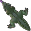

# laser_pointer

https://github.com/naelstrof/laser_pointer/assets/1131571/caad58f2-53f0-4422-ab96-196db587efc1

An app designed to allow a tutor to point at things on a student's screen remotely. It's best paired with a streaming
app like discord.

## Features

Automatic NAT port forwarding, easily share IP and port to connect and start pointing at stuff.

Allows for multiple people to connect to the same student simultaneously, multiplayer pointing!

Color-coded cursors, so you can tell which cursor is which.

Direct ip connections (unsafe, users will know where you live, can ddos you!), it sends raw UDP packets without any proxying. (sorry!) PLEASE only use it with your really good friends.

Custom cursors! You can author a custom cursor and it gets sent over the net!

## Usage as a Student

Simply run laser_pointer by double-clicking on it, then share the address and port it provides to the tutor. If it says it failed to find the gateway, that means you'll have to manually port-forward, sorry!

## Usage as a Tutor

If you're unfamiliar with command line utitilies, this might be hard!

Start with installing the new Windows Terminal: [https://aka.ms/terminal](https://aka.ms/terminal) Make sure to allow it to add a context menu to your right-click during install!

Get the student's laser_pointer ip and port. Then right-click on a blank space in explorer and hit "Open in Terminal"


Then type the following inside (you can right-click to paste):

```shell
.\laser_pointer.exe --address=192.168.1.123:12345
```

but instead of `192.168.1.123:12345` use the address and port that the student gave you. Make sure to press enter to run it.

This should open a window that allows you to click to make a cursor appear on their screen.

## Customizing the cursor

Cursors are customized client-side, and sent to the server.

Cursors are loaded as a spritesheet with frames, horizontally stacked 64x64 images. Below is an example cursor that licks on right-click.



Animations are loaded via json, supporting 3 states, the idle state is ignored as it won't be visible. All animations are looped. Durations in seconds.

```json
{
  "idle": {
    "frames": [
      {
        "index": 0,
        "duration": 1.0
      }
    ]
  },
  "visible": {
    "frames": [
      {
        "index": 0,
        "duration": 1.0
      }
    ]
  },
  "flashing": {
    "frames": [
      {
        "index": 0,
        "duration": 0.1
      },
      {
        "index": 1,
        "duration": 0.1
      }
    ]
  }
}
```

```shell
.\laser_pointer.exe --animation-json-path=./my_custom_animation_states.json
```
